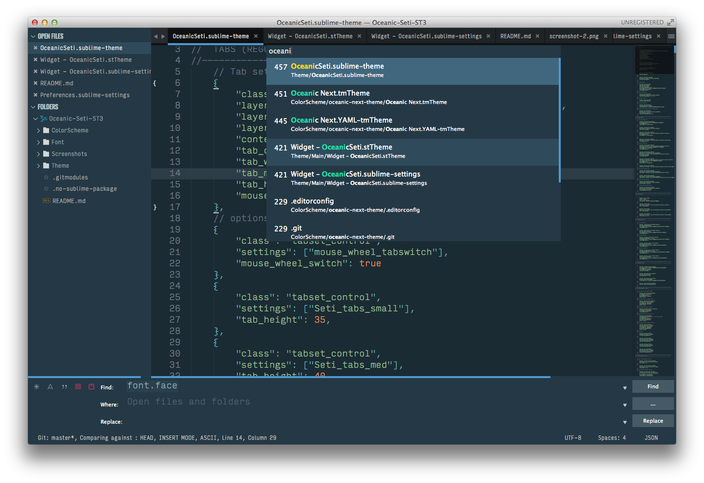

# OceanicSeti Theme

A fork from Seti_ST3 by [ctf0](https://github.com/ctf0/Seti_ST3), which ported from `SublimeText 3 Theme & ColorScheme` Seti_UI & Syntax by [jesseweed](https://github.com/jesseweed/seti-ui)




## Install

1. [Download the .zip](https://github.com/yukaihuang1993/Oceanic-Seti-ST3/archive/master.zip).

2. Unzip and find the folder named ``OceanicSeti``.

3. Copy the folder into `Packages` directory, which you can find using the menu item `Preferences -> Browse Packages...` in Sublime Text.

4. Install Oceanic Next ColorScheme via Package Control or something.

5. Install fonts in Font folder.

## Setup

Activate the `Theme` and `Color-Scheme` by modifying your user preferences file, which you can find using the menu item `Preferences -> Settings - User` in Sublime Text or use `Schemr` & `Themr` by [Ben Weier](https://github.com/benweier).

### My settings

```json
{
  "Seti_in_4_a_treat": true,
  "Seti_mouse_wheel_tabswitche": true,
  "Seti_no_bar_undertabs": true,
  "Seti_sb_tree_miny": true,
  "Seti_tabs_small": true,
  "caret_extra_width": 2,
  "theme": "OceanicSeti.sublime-theme",
  "font_face": "InputMono Thin for Powerline", // great font for coding
  "color_scheme": "Packages/User/SublimeLinter/Oceanic Next (SL).tmTheme", // use Oceanic Next ColorScheme
  "line_padding_bottom": 2,
  "line_padding_top": 2,
}
```

## Credits
- This Theme is a Fork from [ctf0](https://github.com/ctf0/Seti_ST3)

- The color is inpired by [voronianski's oceanic-next-theme](https://github.com/voronianski/oceanic-next-theme), you can find it in ColorScheme folder.
